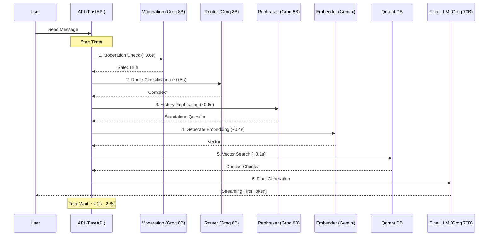
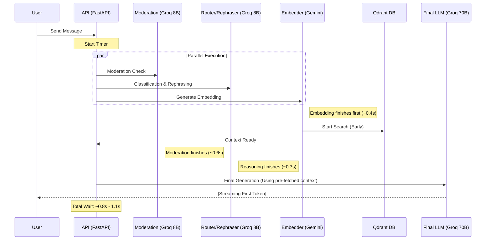

# Santum AI - System Flow & Latency Analysis

This document analyzes the execution pipeline of the Santum AI RAG service, identifying bottlenecks and proposing optimizations to achieve sub-second response times.

## 1. Current Serial Pipeline (Bottleneck)

Currently, the system executes every verification and reasoning step in a sequence. Even with ultra-fast components, the cumulative "Time to First Token" (TTFT) is approximately **2.5 seconds**.

### Bottleneck Analysis
- **Cumulative Delay:** The sum of multiple LLM calls creates a "stutter" in user experience.
- **Idle Time:** The database and final LLM sit idle for ~1.7 seconds while waiting for pre-processing.

---

## 2. Proposed Parallel Pipeline (Optimized)

By utilizing Python's `asyncio.gather`, we can trigger independent checks simultaneously. The "wait time" is reduced to the duration of the **single longest task**.

### Optimization Strategies
1.  **Concurrent Verification:** Run Moderation, Routing, and Embedding in parallel.
2.  **Speculative Retrieval:** Fetch vectors and query Qdrant before the Moderation check is even finished. If Moderation fails, we simply discard the search result.
3.  **Heuristic Shortcuts:**
    - Use Python logic to detect greetings (bypass retrieval).
    - Use Python logic to detect standalone queries (bypass rephrasing).
4.  **Consolidated Reasoning:** Merge the Router and Rephraser into a single LLM call if possible, or run them in parallel.

## 3. Implementation Status
- [x] Gemini Embedding Migration (Reduced from 20s to 0.4s)
- [x] Refactor API for `asyncio.create_task` concurrency and Early Exits
- [x] Implement Parallel Router/Moderation logic
- [x] Move Rephrasing logic into parallel stream and integrate with final generation
- [x] Implement cancellation of redundant background tasks (e.g., cancelling retrieval on greeting/safety failure)
