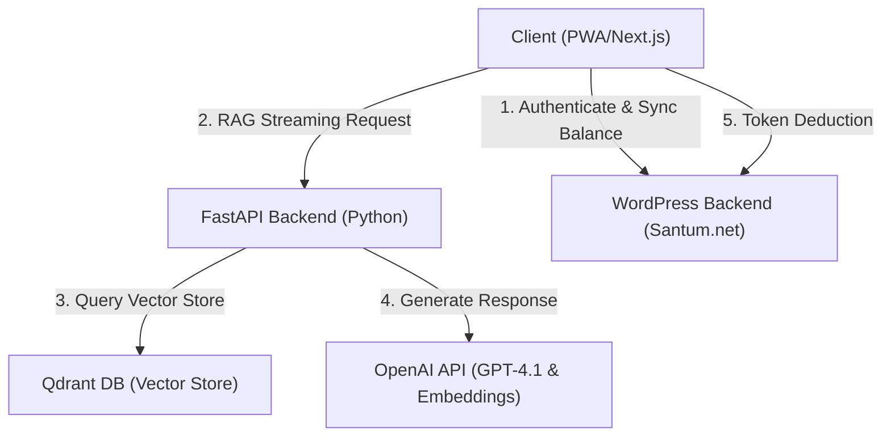

# Santum AI PWA - Project Overview & Technical Scope

This document serves as the unified project scope and technical overview for the **Santum AI Progressive Web Application (PWA)** ecosystem.

---

## 1. Project Summary

The **Santum AI PWA** is a standalone, installable mobile/desktop application designed to provide users with empathetic emotional-wellbeing support. It acts as an AI counselor (named **Sai**), powered by OpenAI's GPT-4.1 model family and anchored in custom cognitive behavioral therapy (CBT) manuals via Retrieval-Augmented Generation (RAG).

The application functions as a decoupled extension of the main platform, [Santum.net](https://santum.net). It communicates with WordPress for authentication, subscription tracking, and credit logs while offloading AI inference to a high-performance Python FastAPI backend.

---

## 2. Core Technical Stack



*   **Frontend Client:** Next.js (production) and Streamlit (sandbox testing).
*   **AI Microservice (Backend):** Python FastAPI, LangChain, and Qdrant.
*   **Master System (Central Database & Authentication):** WordPress (WooCommerce + PMPro + Custom Plugins).
*   **LLM Provider Infrastructure:** OpenAI (GPT-4.1 model family for inference and `text-embedding-3-small` for embeddings).
*   **Database (Vectors):** Qdrant (Cloud or local Docker instances) with 1536-dimensional cosine vectors.

---

## 3. Core Features & Functionality

### AI Counseling Chat
*   **Persona ("Sai"):** Warm, empathetic, and clinically bounded counseling.
*   **Dynamic Response Lengths:** Openers are brief (~50 words), while deep emotional venting is reflective (~250 words max).
*   **Selective & Tiered RAG:** Ingestion of custom manuals split into 600-token chunks with 10% overlap.
*   **Safety Safeguards:** Mood check-in scales (1-10 on Happiness, Stress, Energy), crisis trigger classification, and conditional redirection to human therapists on [Santum.net](https://santum.net).

### Token & Credit System
*   **Source of Truth:** Credit records are stored in the WordPress custom table `credit_log`. Balance is cached in user metadata (`_pwa_credit`).
*   **Exchange Rate:** 1 LLM Token = 1 PWA Credit.
*   **Deduction Principle:** Calculations count only **(User Input + AI Output)** to avoid billing users for system prompts or RAG context overhead. Token updates occur as the final Server-Sent Event (SSE) packet.

### Subscription Plans
*   **Free Tier:** Restricted to Santum.net FAQ retrieval. Generates mood-aware, dynamic soft upgrade messages using `gpt-4.1-nano` if matching a restricted CBT chunk. Input limit is capped at 80 words.
*   **Standard Tier:** Retrieves up to `k=2` chunks from standard CBT manuals. Input limit is capped at 100 words.
*   **Premium Tier:** Retrieves up to `k=3` chunks from all manuals. Input limit is capped at 120 words.

---

## 4. System Architecture & Flows

### A. Authentication Flow
1.  **Mobile Login:** User enters phone number and password → WordPress REST API validates → Returns JWT token.
2.  **Social Login:** User redirects to provider → Callback handles registration/lookup on WordPress → Generates JWT → Redirects to client PWA.
3.  **User ID Convention:** Mobile-registered users are formatted as `{mobile}@santum.net` in the WordPress database.

### B. Registration & Verification
1.  User enters mobile details.
2.  FastAPI/WordPress generates a one-time OTP and triggers the hook:
    ```php
    do_action('pwa_send_sms_otp', $user_id, $otp, $expiry);
    ```
3.  User enters OTP, validation checks out, and account is marked as active.

### C. Membership & Checkout
1.  User chooses a plan tier inside the PWA.
2.  Client redirects to WordPress checkout URL:
    ```
    https://santum.net/membership-checkout/?level={level_id}
    ```
3.  After checkout, Paid Memberships Pro triggers credit updates via the hook:
    ```php
    add_action('pmpro_after_checkout', 'pwa_sync_credits', 10, 2);
    ```

### D. Credit Operations & Error Rollbacks
1.  Client requests streaming response → Deducts estimated tokens/credits prior to generation.
2.  FastAPI streams text back to the client.
3.  Final SSE chunk contains the actual token counts (`total_tokens`).
4.  Client updates the user's WordPress profile with the exact deduction. If the AI call fails midway, a database rollback restores the deducted balance.

---

## 5. Detailed Scope of Work

### 1. Frontend (PWA) Customization
*   Branding synchronization (logos, Outfit/Inter typography, color schemes).
*   Slider check-ins for Happiness, Stress, and Energy.
*   Displaying real-time token balances and plan statuses.

### 2. AI Chat Microservice
*   **Multi-Model Strategy:**
    *   `gpt-4.1`: counseling and reasoning.
    *   `gpt-4.1-mini`: background summaries, title generation, memory logs, and safety moderation.
    *   `gpt-4.1-nano`: router classifications and dynamic refusals.
*   **Heuristic Greetings Bypass:** Fast-track greetings (e.g. "hi", "good morning") directly in Python to bypass vector database queries (sub-100ms response).
*   **Memory Management:** Truncates chat history to the last 6 messages to prevent context bloat.

### 3. API Integration (Santum.net)
*   JWT cookie management.
*   Syncing user metadata and credit balances between Next.js and WordPress REST API.

---

## 6. Access & Staging Information

*   **Production Domain:** `https://santum.net`
*   **Staging Area:** `https://dddemo.net/wordpress/2026/santum/`
*   **Admin Settings Screenshot:** `https://prnt.sc/a56iQ67sPLIX`
