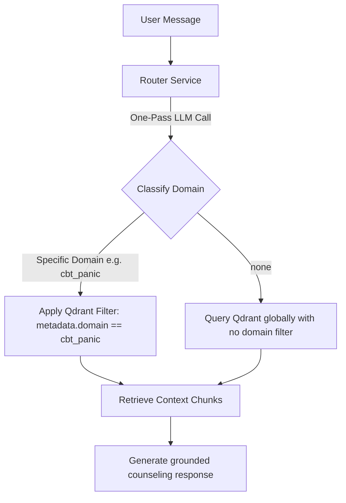

# Implementation Plan: Domain-Based RAG Retrieval

This document outlines the design and step-by-step implementation plan for applying dynamic, domain-based filters on semantic search queries using Qdrant payload filters.

---

## 1. Design Overview

To prevent cross-topic pollution (e.g., retrieving assertiveness techniques when the user is discussing a panic attack), the system will classify the user's clinical concern into a specific **Domain** at the routing stage. 

The vector database will then perform semantic search restricted specifically to that domain.

### Available Domains
* `cbt_assertiveness` (Assertiveness Workbook)
* `cbt_bipolar` (Bipolar support manual)
* `cbt_body_acceptance` (Body acceptance / BDD manual)
* `cbt_body_image` (Body image manual)
* `cbt_depression` (Depression workbook)
* `cbt_eating_disorder` (Eating disorder recovery manual)
* `cbt_gad` (Generalised anxiety workbook)
* `cbt_panic` (Panic workbook)
* `cbt_self_esteem` (Self-esteem workbook)
* `cbt_social_anxiety` (Social anxiety workbook)
* `platform` (Platform FAQ/Santum Facts)
* `none` (General conversational queries, greetings, or when the domain is ambiguous)

---

## 2. Logical Flow



---

## 3. Step-by-Step Implementation Details

### Step 1: Update Router Prompt & Output Schema (`app/services/router.py`)

We will update the system prompt in `RouterService` to instruct the model to identify the domain of the query.

#### Proposed JSON Output Format:
```json
{
  "classification": "greeting" | "conversational" | "rag_required",
  "standalone_query": "string",
  "domain": "cbt_panic" | "cbt_depression" | "cbt_assertiveness" | "cbt_bipolar" | "cbt_body_acceptance" | "cbt_body_image" | "cbt_eating_disorder" | "cbt_gad" | "cbt_self_esteem" | "cbt_social_anxiety" | "platform" | "none"
}
```

---

### Step 2: Update Output Parsing in `RouterService.process_query`

We will modify the return type of `process_query` to return a 3-tuple containing `(classification, standalone_query, domain)`.

```python
async def process_query(self, message: str, chat_history: list = []) -> Tuple[str, str, str]:
    ...
    domain = data.get("domain", "none").lower()
    return classification, standalone_query, domain
```

---

### Step 3: Apply Qdrant Filter in `RAGService` (`app/services/rag_service.py`)

During speculative search orchestration, `RAGService` will extract the domain and apply a dynamic `metadata.domain` match filter in Qdrant if the domain is not `"none"`.

#### Conceptual Changes in `rag_service.py`:
```python
# Extract routing classifications
classification, standalone_query, domain = router_result

# Prepare speculative retrieval with dynamic filter
search_kwargs = {"k": 5}
if domain and domain != "none":
    search_kwargs["filter"] = rest.Filter(
        must=[
            rest.FieldCondition(
                key="metadata.domain",
                match=rest.MatchValue(value=domain)
            )
        ]
    )

retriever = vectorstore.as_retriever(search_kwargs=search_kwargs)
```

---

## 4. Why This Approach is Superior

1. **Native DB Performance**: Dynamic filters run at search-time inside Qdrant's Rust engine utilizing our indexed `metadata.domain` payload index, achieving <10ms response times.
2. **Clinical Accuracy**: Assures high-quality grounding by restricting retrieve-time boundaries to the exact manual addressing the user's clinical situation.
3. **Graceful Failures**: If the domain is ambiguous, the router defaults to `"none"` which skips filtering and executes a global search, ensuring we never miss valid context.

---
*Created: July 3, 2026*
