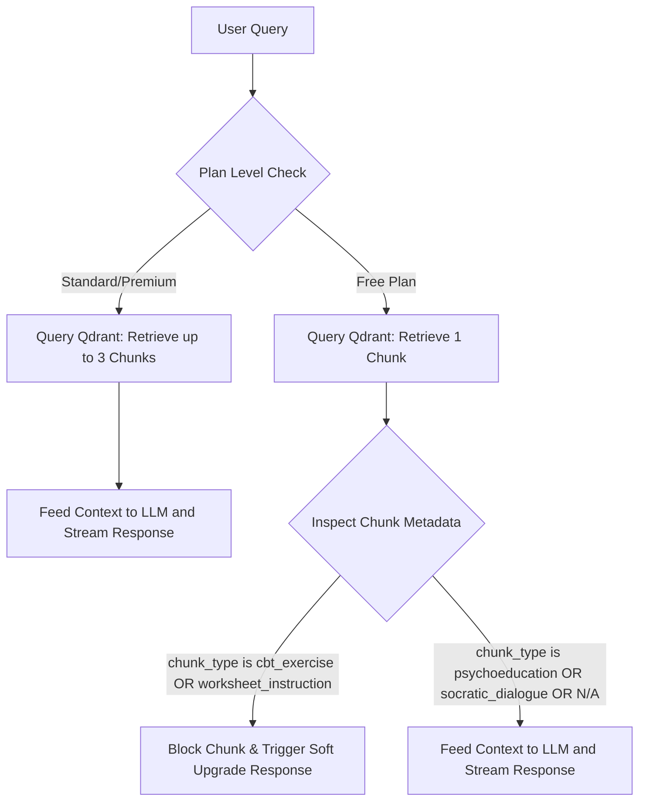

# Implementation Plan: Metadata-Based RAG Tier Restrictions

This document outlines the design and implementation plan for enforcing subscription plan restrictions on RAG search results using chunk metadata filters rather than hardcoded ID blocklists.

---

## 1. Design Overview

Instead of maintaining a static list of blocked chunk IDs (which requires manual updates when manuals are added or updated), the system will inspect the metadata of retrieved chunks in real-time. 

If a retrieved chunk contains metadata indicating that it is a paid-tier feature, the backend will intercept the flow and present the user with a polite upgrade prompt.

### Key Rules
* **Free Plan Users**: Can access `psychoeducation`, `socratic_dialogue`, and platform facts. They are **denied** direct access to `cbt_exercise` and `worksheet_instruction` content.
* **Standard & Premium Users**: Have full access to all chunk types.
* **Refusal Trigger**: If a Free plan user requests an exercise/worksheet or if the search retrieves restricted chunks, they are shown a soft upgrade prompt.

---

## 2. Why This Design is Superior

1. **Zero-Maintenance / Future-Proof**: Any new manuals added by the client will automatically be restricted if their exercises are tagged as `cbt_exercise` or `worksheet_instruction`. No code updates are needed.
2. **Fixes Panic Manual Omission**: The Panic manual contains 48 exercises and worksheets that were omitted from the client's static blocklists. Since these chunks are already tagged in the JSON metadata, this approach blocks them automatically.
3. **No Memory Overhead**: The system does not need to load a set of 459+ chunk IDs into RAM on startup.

---

## 3. Logical Flow



---

## 4. Implementation Details (Target: `app/services/rag_service.py`)

### A. Disable Database-Level Filtering
Currently, the codebase filters out all manual content for the Free tier at the database query level:
```python
# CURRENT CODE: Blocks all manual chunks
if plan_level == PlanLevel.FREE:
    search_kwargs["filter"] = rest.Filter(...)
```
Under the new plan, we remove this database filter to allow Qdrant to search manuals, enabling us to detect when the user is asking for exercises.

### B. Add Chunk Metadata Detection
After retrieving chunks from Qdrant, check their `chunk_type` metadata field:

```python
# PROPOSED CODE CONCEPT
is_restricted = False
for doc in docs:
    ct = doc.metadata.get("chunk_type")
    if ct in ["cbt_exercise", "worksheet_instruction"]:
        is_restricted = True
        break
```

### C. Handle the Soft Upgrade Prompt
If `is_restricted` is `True`, the system will bypass standard RAG prompt construction and yield a polite message prompting the user to upgrade:

> *"To access interactive exercises, worksheets, and specialized CBT tools, please upgrade to our Standard or Premium plan."*

---
*Created: July 1, 2026*
